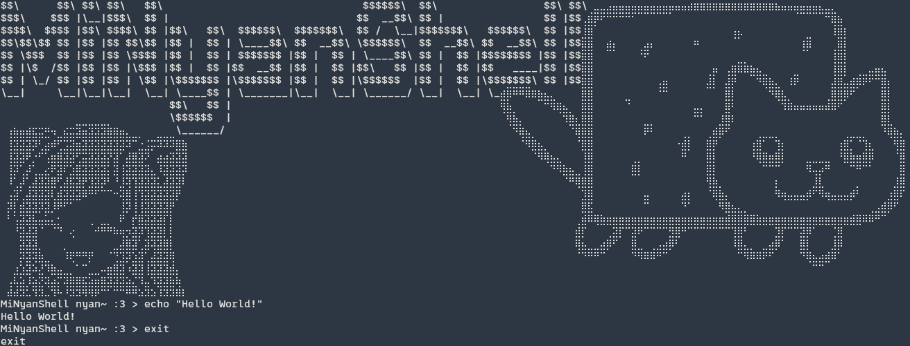

# MiNyanShell 

**MiNyanShell** is a the 42's Minishel Project, a terminal emulador based on GNU's bash's behaviour 
 

## 🐾 Features

- Execute **basic commands** (`ls`, `pwd`, `echo`, etc.)  
- Supports **pipes** (`|`) and **redirections** (`>`, `<`, `>>`)  
- Handles **environment variables**  
- Implements **built-in commands**: `cd`, `export`, `unset`, `exit`  
- **Cat-themed Easter eggs** sprinkled in for fun 🐱  

### Protected ASCII Art File

- The shell **requires** the file `MiNyanShell.txt` to run.  
- This file contains the 24-line cat-themed ASCII art displayed at startup.  
- MiNyanShell uses a **FNV-1 hash** to verify the file’s integrity.  
- If the file is **missing or altered**, the shell **refuses to start**, ensuring the included art is always present.  
- This mechanism acts as a lightweight **protection layer** for the project’s assets.

- Error handling for invalid commands or syntax

